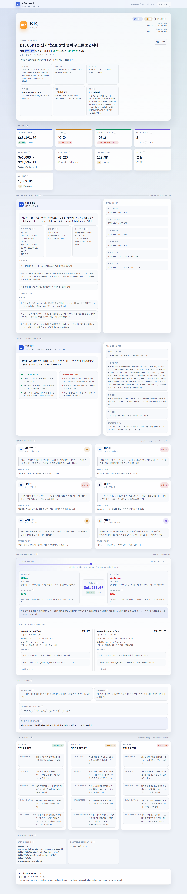
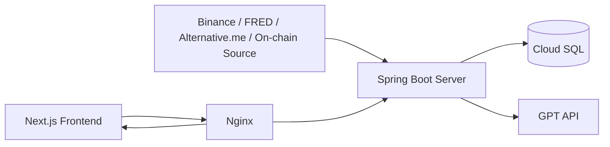
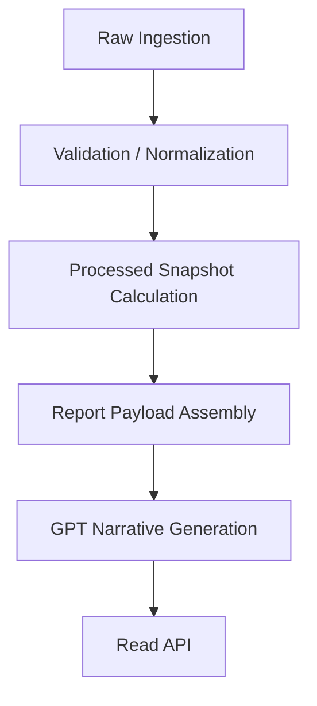
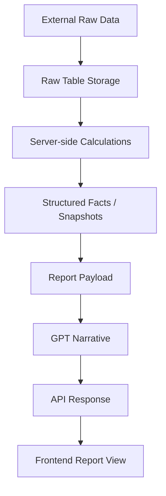

# AI Coin Assist

> Raw market data를 서버에서 구조화된 분석 팩트로 가공하고,  
> GPT는 그 팩트를 기반으로만 해석을 작성하도록 설계한 암호화폐 시장 해석 시스템

## Result

실제 배포 화면 예시:

이 프로젝트는 최종적으로 다음 결과를 제공합니다.

- BTC 기준 단기 / 중기 / 장기 리포트
- 기술지표, 구조, 거래 참여도, 외부 맥락을 함께 읽는 분석 화면
- 서버 계산 기반의 구조화 데이터
- GPT가 작성한 내러티브 요약과 시나리오

## Highlights

- raw 데이터를 먼저 보존하고, 이후 계산 계층과 리포트 계층을 분리했습니다.
- GPT는 숫자를 계산하지 않고, 서버가 계산한 팩트를 해석하는 역할만 맡습니다.
- 거래량뿐 아니라 거래대금, 체결 수, 시장가 매수 비중까지 함께 읽도록 확장했습니다.
- 단기 / 중기 / 장기 리포트를 각각 다른 비교 기준과 시간축으로 생성합니다.
- 배포 비용을 줄이기 위해 API와 배치를 단일 Spring 서버로 통합했습니다.

## Overview

AI Coin Assist는 자동매매 시스템이 아닙니다.  
목표는 **시장을 더 정확하게 읽고, 사람이 이해할 수 있는 리포트로 정리하는 것**입니다.

현재 이 저장소는 다음을 모두 담당하는 **통합 Spring Boot 서버**입니다.

- 외부 데이터 raw 수집
- 서버 내부 계산 및 스냅샷 생성
- 단기 / 중기 / 장기 리포트 생성
- GPT 내러티브 생성
- 프론트 조회용 API 제공

초기 운영은 `BTC` 중심으로 제한했지만, 구조는 `ETH`, `XRP`까지 확장 가능하게 설계했습니다.

## Why This Project Exists

암호화폐 분석 서비스는 흔히 두 가지 문제를 가집니다.

1. GPT에게 raw 데이터를 과도하게 넘겨 계산과 해석을 동시에 맡긴다.
2. 데이터 수집 계층이 약해서 결과를 재현하거나 검증하기 어렵다.

이 프로젝트는 그 반대로 설계했습니다.

- 계산은 서버가 한다.
- GPT는 해석만 한다.
- raw 데이터는 나중에 다시 검증할 수 있어야 한다.

즉 이 프로젝트의 핵심은 GPT 자체가 아니라,  
**신뢰 가능한 raw 계층과 비교 가능한 계산 계층**입니다.

## Core Design Principles

### 1. Raw-first

외부 API 응답을 먼저 raw로 저장합니다.

- `market_candle_raw`
- `market_price_raw`
- `macro_snapshot_raw`
- `sentiment_snapshot_raw`
- `onchain_snapshot_raw`

이 구조 덕분에 다음이 가능합니다.

- 재수집
- 재처리
- 검증
- 추적

### 2. Comparison-first

이 시스템은 현재 값만 보지 않고,  
**이전 기준점 대비 무엇이 달라졌는지**를 먼저 계산합니다.

GPT에 넘기는 것은 raw 배열이 아니라 이런 팩트입니다.

- 현재 가격과 변화율
- RSI / MACD / ATR 현재값과 변화량
- MA20 / MA60 / MA120 대비 현재 위치
- 최근 레인지 내 위치
- 거래량, 거래대금, 체결 수, 시장가 매수 비중
- 거시 / 심리 / 온체인 변화율

### 3. GPT is the Interpreter, Not the Calculator

GPT는 계산기가 아니라 **최종 해석기**입니다.

GPT가 담당하는 것:

- 전체 해석
- 시나리오 작성
- 지지 / 저항 설명
- 리스크 설명
- 최종 서술형 내러티브 생성

GPT가 담당하지 않는 것:

- raw 대량 비교
- 시계열 기준점 계산
- 기술지표 계산
- 비교값 산출

## Architecture

### Runtime Architecture

### Internal Responsibilities

현재 운영 구성:

- GCP VM 1대
- Cloud SQL MySQL 1개
- Docker Compose
  - `spring-server`
  - `nextjs`
  - `nginx`

## Data Pipeline

핵심은 단순히 `External Data -> GPT`가 아니라,

**External Data -> Server Calculations -> GPT Interpretation**

이라는 점입니다.

## What Data Is Collected

### Market / Price

Binance 기준:

- 현재가 raw
- OHLCV candle raw
- 거래량
- 거래대금 (`quoteAssetVolume`)
- 체결 수 (`numberOfTrades`)
- 시장가 매수 거래량 / 거래대금 (`takerBuy*`)

단순 volume만 보는 대신,

- 실제 자금이 붙었는가
- 참여가 넓었는가
- 공격적 매수가 우세했는가

를 같이 읽도록 설계했습니다.

### Macro

- DXY proxy
- US 10Y yield
- USD/KRW

### Sentiment

- Fear & Greed Index

### On-chain

- 활성 주소
- 트랜잭션 수
- 시가총액 계열 팩트

## What the Server Computes

수집된 raw 데이터는 GPT에 그대로 보내지지 않습니다.  
서버가 먼저 해석 가능한 형태로 구조화합니다.

### Technical Indicators

- MA
- RSI
- MACD
- ATR
- Bollinger Bands

금융 계산은 `BigDecimal` 중심으로 처리하고,  
RSI / ATR은 Wilder smoothing 정의를 따릅니다.

### Market Structure

- 최근 레인지 고점 / 저점
- 현재 위치
- 지지 / 저항 후보
- 지지 / 저항 구간
- zone interaction

### Market Participation

단순 거래량 외에도 다음을 계산합니다.

- 거래대금 변화율
- 체결 수 변화율
- 시장가 매수 비중
- 직전 동일 구간 대비 변화

대표 시간창:

- 단기: `3h / 6h / 24h`
- 중기: `3d / 7d / 30d`
- 장기: `30d / 90d / 180d`

## Report Horizons

- 단기: `PREV_BATCH`, `D1`, `D3`, `D7`
- 중기: `D7`, `D14`, `D30`, `PREV_MID_REPORT`
- 장기: `D30`, `D90`, `D180`, `Y52_HIGH_LOW`, `PREV_LONG_REPORT`

시간축을 분리한 이유는 각 리포트가 읽어야 하는 구조적 문맥이 다르기 때문입니다.

## Prompt Design

프롬프트는 “멋지게 써라”보다  
**서버가 계산한 팩트를 근거로 논리적으로 설명하라**에 맞춰 설계했습니다.

기준:

- 계산된 수치를 임의로 바꾸지 말 것
- 서버가 제공한 비교 기준을 우선할 것
- 거래량만이 아니라 거래대금 / 체결 수 / 시장가 매수 비중까지 해석할 것
- 돌파 / 이탈 / 구조 유지 여부를 참여도와 함께 볼 것
- 과장보다 근거 중심으로 쓸 것
- 모호한 예측보다 시나리오 형태로 정리할 것

## Time Design

시간 의미를 분리해서 관리합니다.

- `analysisBasisTime`
- `rawReferenceTime`
- `priceSourceEventTime`
- `openTime`
- `closeTime`

원칙:

- 저장과 API 응답은 `UTC`
- 프론트 표시만 `KST`

## Persistence Model

### 1. Raw Layer

원본 / 소스 보존 목적

- `market_candle_raw`
- `market_price_raw`

### 2. Processed Layer

서버 계산 결과 저장 목적

- `market_indicator_snapshot`
- `market_window_summary_snapshot`
- `market_context_snapshot`
- `candidate_level_snapshot`

### 3. Report Layer

사용자용 리포트 저장 목적

- `analysis_report`
- `analysis_report_narrative`
- `analysis_report_shared_context`

이 구조를 통해 raw 재처리, 계산 재현, 리포트 추적이 가능합니다.

## Output Delivered by This System

### Server-side Outputs

- raw market data
- technical indicator snapshots
- market participation summaries
- support / resistance / zone context
- report payload
- GPT narrative

### User-facing Outputs

- 최신 리포트 요약
- 상세 리포트
- 거래 참여도 카드
- 시나리오 / 결론 / 위험 요인

## Engineering Trade-offs

우선한 것:

- 재현성
- 추적 가능성
- 계산 정확성
- raw 보존
- GPT 비용 통제

의도적으로 뒤로 미룬 것:

- 과도한 실시간성
- 초기부터 복잡한 멀티서비스 운영
- GPT 자동화를 우선하는 구조

## Frontend Repository

- [AI Coin Assist Frontend](https://github.com/SuHyeonEo/ai-coin-assist-frontend)

## One-line Summary

AI Coin Assist는 **시장 데이터를 raw로 보존하고, 서버가 비교 가능한 팩트로 구조화한 뒤, GPT는 그 팩트를 해석하는 역할만 맡도록 설계한 암호화폐 시장 해석 시스템**입니다.
