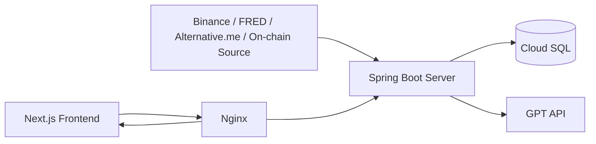
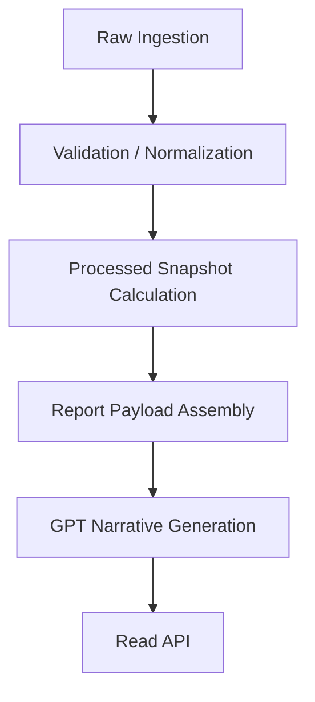
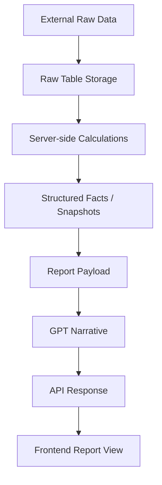

# AI Coin Assist

> Raw market data를 서버에서 구조화된 분석 팩트로 가공하고,  
> GPT는 그 팩트를 기반으로만 해석을 작성하도록 설계한 **암호화폐 시장 해석 시스템**

## Overview

AI Coin Assist는 자동매매 시스템이 아닙니다.  
이 프로젝트의 목적은 **시장을 더 정확하게 읽고, 사람이 이해할 수 있는 리포트로 정리하는 것**입니다.

이 저장소는 현재 프로젝트의 **단일 통합 Spring Boot 서버**이며, 다음 기능을 함께 수행합니다.

- 외부 데이터 raw 수집
- 서버 내부 계산 및 스냅샷 생성
- 단기/중기/장기 리포트 생성
- GPT 내러티브 생성
- 프론트 조회용 API 제공

초기 운영은 `BTC` 기준으로 제한하고 있으며, 구조적으로는 `ETH`, `XRP`까지 확장 가능하게 설계했습니다.

## Why This Project Exists

암호화폐 분석 서비스는 흔히 두 가지 문제를 가집니다.

1. GPT에게 raw 데이터를 과도하게 넘겨 계산과 해석을 동시에 맡긴다.
2. 데이터 수집 계층이 약해서 결과를 나중에 재현하거나 검증하기 어렵다.

이 프로젝트는 그 반대 방향으로 설계했습니다.

- 계산은 서버가 한다.
- GPT는 해석만 한다.
- raw 데이터는 나중에 다시 검증할 수 있어야 한다.

즉, 이 프로젝트의 핵심은 GPT가 아니라 **데이터 계층과 계산 계층의 신뢰성**입니다.

## Core Design Principles

### 1. Raw-first

리포트의 신뢰도는 GPT보다 raw 데이터 계층에 더 크게 좌우된다고 판단했습니다.

그래서 외부 API 응답을 먼저 raw로 저장합니다.

- `market_candle_raw`
- `market_price_raw`
- `macro_snapshot_raw`
- `sentiment_snapshot_raw`
- `onchain_snapshot_raw`

이 구조 덕분에:

- 재수집 가능
- 재처리 가능
- 검증 가능
- 추적 가능

상태를 유지할 수 있습니다.

### 2. Comparison-first

이 시스템은 “현재 값”만 보는 것이 아니라,  
**현재 값이 이전 기준점에 비해 어떻게 달라졌는지**를 먼저 계산합니다.

예를 들어 GPT에 넘기는 핵심 입력은 raw 배열이 아니라 다음과 같은 팩트입니다.

- 현재 가격
- 전일 대비 변화율
- RSI 현재값과 변화량
- MACD histogram 현재값과 변화량
- ATR 현재값과 평균 대비 상대값
- MA20 / MA60 / MA120 대비 현재 위치
- 최근 레인지 내 현재 위치
- 거래량 / 거래대금 / 체결 수 / 시장가 매수 비중
- 거시 / 심리 / 온체인 변화율

### 3. GPT is the Interpreter, Not the Calculator

GPT는 최종 해석기입니다. 계산기는 아닙니다.

GPT가 담당하는 것:

- 전체 해석
- 시나리오 작성
- 지지/저항 설명
- 리스크 설명
- 최종 서술형 내러티브 생성

GPT가 담당하지 않는 것:

- raw 대량 비교
- 시계열 기준점 계산
- 기술지표 계산
- 비교값 산출

## Architecture

### Runtime Architecture

### Internal Server Responsibilities

현재 운영 구성:

- GCP VM 1대
- Cloud SQL MySQL 1개
- Docker Compose
  - `spring-server`
  - `nextjs`
  - `nginx`

## Data Pipeline

### Full Pipeline

핵심은 **External Data -> GPT**가 아니라,

**External Data -> Server Calculations -> GPT Interpretation**

이라는 점입니다.

## What Data Is Collected

### Market / Price

Binance 기준:

- 현재가 raw
- OHLCV candle raw
- 거래량
- 거래대금 (`quoteAssetVolume`)
- 체결 수 (`numberOfTrades`)
- 시장가 매수 거래량 / 거래대금 (`takerBuy*`)

여기서 중요한 포인트는 단순 volume만 보지 않는다는 점입니다.  
이 프로젝트는 “얼마나 거래됐는가”보다 더 나아가:

- 실제 자금이 붙었는가
- 참여가 넓었는가
- 공격적 매수가 우세했는가

를 같이 보도록 설계했습니다.

### Macro

FRED 기반 예시:

- DXY proxy
- US 10Y yield
- USD/KRW

### Sentiment

- Fear & Greed Index

### On-chain

- 활성 주소
- 트랜잭션 수
- 시가총액 계열 팩트

## What the Server Computes

수집된 raw 데이터는 GPT에 그대로 보내지지 않습니다.  
서버가 먼저 계산 가능한 형태로 구조화합니다.

### Technical Indicators

- MA
- RSI
- MACD
- ATR
- Bollinger Bands

금융 계산은 `BigDecimal` 중심으로 처리하고,  
RSI/ATR은 Wilder smoothing 정의를 따릅니다.

### Market Structure

- 최근 레인지 고점/저점
- 현재 위치
- 지지/저항 후보
- 지지/저항 구간
- zone interaction

### Market Participation

이 프로젝트에서 특히 중요하게 다룬 확장 지점입니다.

서버는 단순 거래량 외에도 다음을 계산합니다.

- 거래대금 변화율
- 체결 수 변화율
- 시장가 매수 비중
- 직전 동일 구간 대비 변화

그리고 이를 리포트 타입별 대표 시간창으로 나눕니다.

- 단기: `3h / 6h / 24h`
- 중기: `3d / 7d / 30d`
- 장기: `30d / 90d / 180d`

즉 “최근 1개 캔들”만 보는 해석을 피하고,  
여러 시간 구간에서 참여 강도를 같이 읽도록 만들었습니다.

## Report Horizons

### Short-term

목표:

- 최근 움직임의 강도
- 직전 배치 대비 변화
- 단기 지지/저항 반응
- 짧은 시나리오

대표 비교 기준:

- `PREV_BATCH`
- `D1`
- `D3`
- `D7`

### Mid-term

목표:

- 구조 유지 / 이탈
- 일/주 단위 추세 해석
- 중기 지지/저항

대표 비교 기준:

- `D7`
- `D14`
- `D30`
- `PREV_MID_REPORT`

### Long-term

목표:

- 장기 추세 / 사이클 위치
- 장기 고점/저점 대비 상대 위치
- 장기 리스크와 방어 구간

대표 비교 기준:

- `D30`
- `D90`
- `D180`
- `Y52_HIGH_LOW`
- `PREV_LONG_REPORT`

## Why the Server Must Structure Data Before GPT

이 프로젝트에서 가장 중요하게 잡은 설계 판단은 이것입니다.

> GPT에게 raw를 많이 주는 것이 더 똑똑한 시스템을 만들지는 않는다.

오히려 다음 문제가 생깁니다.

- 같은 질문에도 계산 기준이 달라질 수 있음
- 결과 재현이 어려움
- 검증이 어려움
- 왜 그런 결론이 나왔는지 추적이 어려움

그래서 GPT 입력은 다음 기준을 따릅니다.

- raw 배열 대신 구조화된 팩트 제공
- 숫자/비교값/위치 정보 우선
- 모호한 라벨보다 수치 중심
- 해석에 필요한 문맥은 서버가 먼저 정리

즉 GPT는 “계산”이 아니라 “해석”만 담당합니다.

## GPT Output Scope

GPT가 생성하는 핵심 결과물은 **narrative**입니다.

예:

- 한 줄 요약
- 전체 결론
- 강세/약세 요인
- 전술적 관점
- 도메인별 해석
  - macro
  - sentiment
  - on-chain
- 시나리오
- 위험 요인

## Prompt Design

프롬프트는 “멋지게 써라”가 아니라  
**정해진 팩트를 근거로 논리적으로 설명하라**는 방향으로 설계했습니다.

### Prompt Writing Criteria

- 계산된 수치를 임의로 바꾸지 말 것
- 서버가 제공한 비교 기준을 우선할 것
- 거래량만이 아니라 거래대금/체결 수/시장가 매수 비중까지 해석할 것
- 돌파/이탈/구조 유지 여부를 참여도와 함께 볼 것
- 과장보다 근거 중심으로 쓸 것
- 모호한 예측보다 시나리오 형태로 정리할 것

즉 프롬프트는 창의적 문장 생성보다  
**구조화된 팩트 기반 설명**에 초점을 맞춰 설계했습니다.

## Time Design

시간 의미는 명시적으로 분리합니다.

- `analysisBasisTime`
- `rawReferenceTime`
- `priceSourceEventTime`
- `openTime`
- `closeTime`

원칙:

- 저장과 API 응답은 `UTC`
- 프론트 표시만 `KST`

이렇게 분리한 이유는

- 수집 시각
- 캔들 시각
- 실제 시장 가격 시각
- 리포트 분석 기준 시각

이 서로 다른 의미를 갖기 때문입니다.

## Persistence Model

모든 데이터를 한 테이블에 몰지 않고 계층을 분리합니다.

### 1. Raw Layer

원본/소스 보존 목적

- `market_candle_raw`
- `market_price_raw`

### 2. Processed Layer

서버 계산 결과 저장 목적

- `market_indicator_snapshot`
- `market_window_summary_snapshot`
- `market_context_snapshot`
- `candidate_level_snapshot`

### 3. Report Layer

사용자용 리포트 저장 목적

- `analysis_report`
- `analysis_report_narrative`
- `analysis_report_shared_context`

이 구조를 통해:

- raw 재처리
- 계산 재현
- 리포트 추적

이 가능합니다.

## Major Improvements During Development

### 1. Raw-first Migration

리포트 생성 시 live fetch를 없애고,  
저장된 raw 데이터를 기준으로 분석하도록 전환했습니다.

### 2. Participation Expansion

기존 단순 거래량 중심에서 다음까지 확장했습니다.

- 거래대금
- 체결 수
- 시장가 매수 비중
- multi-window participation facts

### 3. API + Batch Integration

배포 비용과 운영 단순화를 위해

- API 서버
- Batch 서버

를 하나의 통합 Spring 서버로 합쳤습니다.

### 4. BTC-first Deployment

초기 운영 안정성과 비용 절감을 위해

- 수집 대상
- 리포트 생성 대상
- API 노출 대상

을 BTC 중심으로 제한하고, 이후 확장이 가능하도록 구조는 유지했습니다.

## Output Delivered by This System

### Server-side Outputs

- raw market data
- technical indicator snapshots
- market participation summaries
- support / resistance / zone context
- report payload
- GPT narrative

### User-facing Outputs

- 최신 리포트 요약
- 상세 리포트
- 거래 참여도 카드
- 시나리오 / 결론 / 위험 요인

## Engineering Trade-offs

이 프로젝트는 다음을 우선했습니다.

### Prioritized

- 재현성
- 추적 가능성
- 계산 정확성
- raw 보존
- GPT 비용 통제

### Deliberately Deferred

- 과도한 실시간성
- 지나친 자동화
- 초기부터 복잡한 멀티서비스 운영

즉 화려함보다 **신뢰 가능한 데이터 구조**를 먼저 선택했습니다.

## Current Operating Notes

현재 이 저장소는 통합 서버 기준입니다.

기본 포트:

- `8082`

주요 경로:

- `/api/health`
- `/api/assets`
- `/api/assets/summaries`
- `/api/reports/latest/summary`
- `/api/reports/latest/detail`
- `/openapi/v3/api-docs`
- `/docs`

프론트엔드 저장소:

- [AI Coin Assist Frontend](https://github.com/SuHyeonEo/ai-coin-assist-frontend)

## One-line Summary

AI Coin Assist는 **시장 데이터를 raw로 보존하고, 서버가 비교 가능한 팩트로 구조화한 뒤, GPT는 그 팩트를 해석하는 역할만 맡도록 설계한 암호화폐 시장 해석 시스템**입니다.
